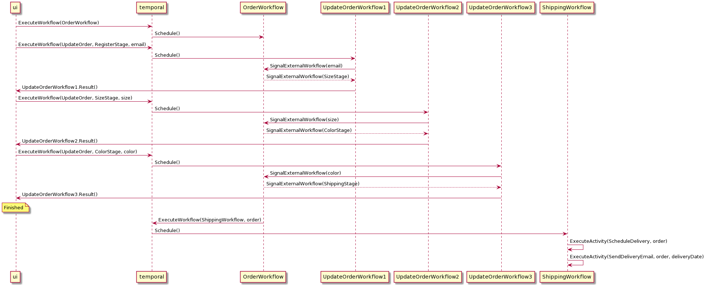

# Purpose

This pattern is used when a non-workflow process needs to advance a workflow state
machine from its initial state to its terminal state. It does this by adding input
data to the workflow (via Signals) and receiving new information back from the
workflow (when a secondary proxy workflow exits and returns a value).

The only way to add information to a workflow is via a Signal.

There are two ways to
get information out of a workflow. One, the workflow has a Query handler and can respond
to queries. However, this is limited in that Queries may not modify the state of the
workflow itself. Two, the workflow can exit and return a result to its caller. This
second approach is leveraged by the pattern to get information back from the primary
workflow. This information could be used to determine branching behavior for the
non-workflow caller.

The flow of calls is outlined in the diagram below.



# Explanation

The primary use-case for this pattern is for a non-workflow process to *send and receive* data
to and from a workflow. Note that a Temporal client may sent a signal to a workflow but the
information transfer is one-way (i.e. fire and forget). There is no mechanism for a workflow
to send a signal to a non-workflow. A keen observer would note that a Query can be used to
ask for information, however a Query is supposed to be idempotent and *should not cause any
state change* in the workflow itself. Also, Queries imply polling for a result which is slow
and inefficient. Therefore, it is not a mechanism for sending new information
into a workflow and receiving a response.

So, the non-workflow process can communicate to a workflow by:

a) Starting that workflow, and

b) Communicating with the workflow by creating proxy workflows to signal the main workflow and
then block for a response. When these proxy workflows exit, they can return the response to the
caller.

In the real world, this pattern could be utilized for managing an interaction via a series of
web pages. Imagine that a user lands on a home page and clicks a link to apply for a library
card. The link hits the web application's controller and can now start the
`ApplyForLibraryCardWorkflow`. The workflow ID could be returned back in a response to the caller
as a session value, for example.

On the next page, the user can fill out the application for the library card by providing their
name, address, and phone number. Upon submission of this form (via POST), the web application
controller can 1) lookup the associated workflow from the session, and 2) create the
`SubmitPersonalDetailsWorkflow` workflow and pass in the form data. This workflow packages up
the data and signals it to the `ApplyForLibraryCardWorkflow` and waits for a response via another
signal. The main workflow applies the appropriate business logic to the payload and advances its
state. It then signals back to the proxy workflow the result of its work and then blocks to
await new data.

Depending on the response from the `ApplyForLibraryCardWorkflow`, the controller can render a page
to continue the application or ask for the user to correct some bad input.

Continue and repeat this action via the web application controller(s) as it moves the user
through the entire library card application journey. By its nature, web applications are all stateless
and asynchronous, so the state and behavior are encapsulated by the workflow and its associated
activity outcomes. The only state outside of the workflow that the web application cares about is the
session information so it can match the user back to the correct workflow.

# Execution

Open two shells / terminal windows. In one, execute:
```shell
ruby worker/worker.rb
```
In the second, execute:
```shell
ruby ui/main.rb
```
In the shell running `ui` it will ask a series of questions. Answer the questions and the
program will send the appropriate signals around to complete the process. Upon completion it
prints a success message.
